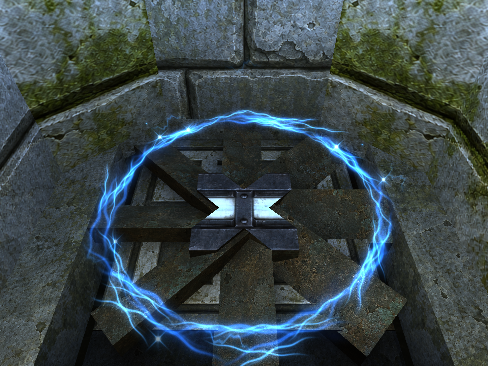
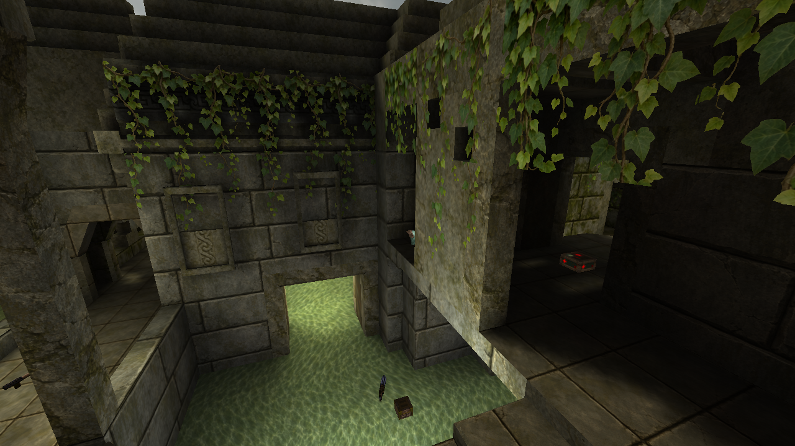
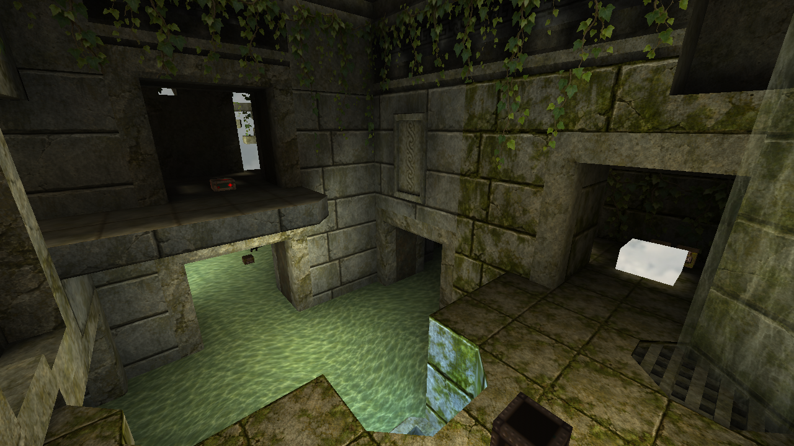
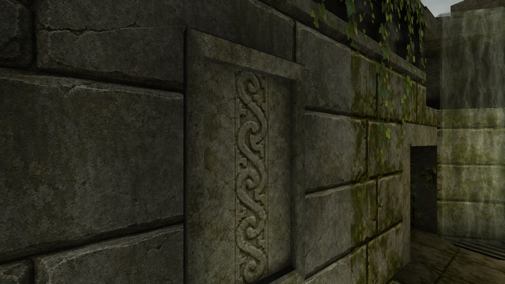

# bspharness

A scriptable workshop for building high-quality **Quake 1 BSP maps**: describe
playable spaces in Python, generate sealed Valve 220 geometry, compile with
ericw-tools, inspect the BSP, and collect in-engine evidence with QSS-M.

The aim is deliberate layouts, strong architecture, readable materials,
expressive lighting, and reliable gameplay. The atrium provides a blockout;
Ember Cloister provides a stock-textured architectural reference with stairs,
arches, a gallery, fixture lighting, fixed cameras, and movement probes.
Polished gameplay maps still need art direction and playtesting.

## Screenshots

Awoken in QSS-M: the latest native FTE jump-pad vortex, followed by views
of the map's stonework, moss, hanging vines, and water. These are unmodified
engine captures; click an image to see its original resolution.

[](docs/screenshots/awoken-fte-vortex.png)

| Central courtyard | Mega balcony | Carved stone detail |
| --- | --- | --- |
| [](docs/screenshots/awoken-courtyard.png) | [](docs/screenshots/awoken-balcony.png) | [](docs/screenshots/awoken-relief.png) |

See the [Awoken particle recipe](maps/awoken/PARTICLES.md) for the effect
and [capture provenance](docs/screenshots/provenance.json) for camera,
render settings, and verified screenshot/build hashes.

## First build

Requires Python 3.10+ and the ericw compilers. The core uses only Python's
standard library. Run these commands from the repository root:

```sh
python3 tools/bootstrap.py
python3 examples/atrium.py
python3 -m bspharness build src/atrium.map --profile draft
python3 -m bspharness inspect out/atrium/draft/atrium.bsp
```

The bootstrap installs checksum-pinned `2.0.0-alpha11` and `v0.18.2-rc1`
bundles for Linux, macOS, or Windows. Linux/Windows bundles require x86_64;
Apple Silicon uses Rosetta. Native custom builds can be passed with
`--qbsp-dir` and `--lighting-dir`.

For final lighting or the extended QSS-M lighting formats:

```sh
python3 -m bspharness build src/atrium.map --profile final
python3 -m bspharness build src/atrium.map --profile showcase
```

`draft` uses fast VIS; `final` uses full VIS, 4x4 light sampling, and external
plus embedded colored lighting. `showcase` also bakes 8-unit luxels, HDR, and
a lightgrid. `mono` keeps standard grayscale BSP lighting and discards the
colored sidecar. Large maps explicitly select `--format bsp2`.

## Original Quake textures

Use your local `pak0.pak` and `pak1.pak`. The harness extracts embedded BSP
textures into a WAD2 and optionally extracts your palette for previews:

```sh
python3 -m bspharness id-wad /path/to/id1/pak0.pak /path/to/id1/pak1.pak \
  --output assets/wads/id1.wad --palette assets/palette.lmp
python3 -m bspharness wad-preview assets/wads/id1.wad \
  --palette assets/palette.lmp --output out/textures/id1
python3 examples/atrium.py --stock-wad assets/wads/id1.wad --output src/atrium_id1.map
python3 -m bspharness build src/atrium_id1.map --profile final
```

Open `out/textures/id1/index.html` to browse the extracted textures by name.
The example also generates original development textures for light strips
and tool materials. No downloaded WAD is needed for the default blockout.

Makkon textures and skyboxes are excluded for now. Other WAD download links
are collected in [the texture catalog](docs/TEXTURES.md). PAKs, WADs,
palettes, compiler binaries, and generated outputs stay out of Git.

## Author maps at the room level

```python
from bspharness import Map, Palette, box, ramp

arena = Map("My map", _bounce="1", _minlight="16")
arena.room("hall", (-384, -256, 0), (384, 256, 320), Palette())
arena.room("side", (384, -128, 0), (768, 128, 192), Palette(wall="bh_accent"))
arena.entity("info_player_start", (0, 0, 24), angle="0")
arena.light((0, 0, 224), 350)
arena.write("src/my_map.map", ["assets/wads/blockout.wad"])
```

Rooms carve air from a padded solid world. Shared boundaries become
doorways, face materials come from room palettes, and sky volumes provide
sunlight openings. Details, ramps, items, lights, and brush entities add
intentional structure inside that shell. See [atrium.py](examples/atrium.py)
for a complete layout with multiple routes and vertical gameplay.

`stairs`, `arch`, `column`, `beam`, and `trim_profile` provide reusable
architectural brushes. `Map.structural` defines walking surfaces and major
partitions; `Map.detail` uses real compiler detail, with wall, fence, and
illusionary variants. Visible `fixture` lights and `lighting_recipe` provide
a starting point for daylight, bounce, and ambient occlusion. See
[the architecture guide](docs/ARCHITECTURE.md), including the 0.3 change to
`Map.detail` behavior.

```sh
python3 examples/reference_hall.py
python3 -m bspharness build src/reference_hall.map --profile final \
  --max-faces 3500 --max-clipnodes 5000
```

This example requires the local stock WAD. Follow
[the reference hall guide](docs/REFERENCE_HALL.md) to test six routes,
review five cameras, retain a baseline, and package the result.

## Align materials and their joins

`Material` supports texel density, physical repeat sizes, shared anchors,
and compatible texture families. Declared wall paths wrap patterns around
corners. Transition rules add doorway frames and flush floor borders
between different room materials. Builds check the compiled BSP's shared
edges and reject UV discontinuities or conflicting repeat sizes.

```sh
python3 examples/materials.py
python3 -m bspharness build src/materials_demo.map --profile final
python3 -m bspharness seams out/materials_demo/final/materials_demo.bsp
```

The diagnostic uses original generated textures, including matching 64px
and 128px tile images. See [the material guide](docs/MATERIALS.md) for API
examples, wall wrapping, trim rules, and the checks' scope. Artwork
compatibility and undeclared corners still require visual review.

## Author particle effects

Original FTE particle scripts and PNG sprites can accompany a map through
source-bound asset manifests. The harness snapshots and verifies their hashes,
stages them for engine QA, checks sprite upload dimensions, and includes the
runtime files in release packages. Use a QSS-M or FTE build with native particle
support. See [the particle guide](docs/PARTICLES.md) for authoring and verification.

The [Awoken jump-pad recipe](maps/awoken/PARTICLES.md) generates electric-blue
filaments, moving white hot spots, rising arcs, and sparse lightning from
original 512px sprites. Its entity-only helper adds visual anchors to a verified
BSP copy while preserving collision, VIS, BSP format, and lighting. Subsequent
sprite/config tuning can use `bind-assets` in a fresh build directory without
repeating the geometry or lighting bake.

Review effects in motion as well as in stills. Camera `settle_frames` controls
warmup; allow for complete paths and staggered emissions. Some unsupported
particle fields are silently ignored, so successful loading alone does not
establish that every layer or moving accent works.

## Engine QA and packaging

[Awoken](maps/awoken/README.md) is the first complete imported arena recipe:
it recovers 4Bidden's Q2 brushwork, maps stock id1 materials and gameplay,
and authors Q1 pad, teleport, spawn, and traversal checks. An optional video
style adds original pale masonry and masked vines, carved reliefs, and
reference-directed lighting. Its geometry pass refines exposed stone
edges, cornices and relief surrounds, with collision checks and close views. Reference assets
and generated BSP/LIT files stay local.

```sh
python3 -m bspharness qa out/atrium/final/atrium.bsp \
  --cameras src/atrium.cameras.json --engine /path/to/QSS-M \
  --basedir /path/to/quake --gamedir bspharness_atrium_qa
python3 -m bspharness package out/atrium/final/atrium.bsp \
  --credits examples/atrium-readme.txt --output dist/atrium.zip \
  --qa-report /path/to/quake/bspharness_atrium_qa/qa.json
```

Use a fresh QA gamedir on every pass. QA checks player ground/health, item
survival in XYZ with unique runtime matches, engine errors, and screenshot count.
Add `--routes src/reference_hall.routes.json` for authored walking/jump probes:
normal collision and health checks run before noclip cameras. Omit
`--cameras` for movement-only checks. Review the PNGs yourself;
automated QA does not judge map design. Packaging checks artifact hashes and
includes the BSP, `.lit` when present, source, credits, and build/validation
reports. QA is optional for development packages; include it for reviewed
releases. Declared runtime PNGs, including skyboxes, and FTE particle scripts
are included in the package. Engine binaries and mod dependencies require
separate installation.
Material builds also include their hash-verified contract and seam report.
Use `compare-qa before/qa.json after/qa.json --output out/comparison-01`
to collect hash-checked, named before/after camera views for visual review.
For an actual stock deathmatch spawn/item audit, use `qa --mode dm` without
routes or cameras. QSS-M disables positioning commands in deathmatch;
run a separate SP pass to check collision and collect fixed views.

## Repository guide

| Path | Purpose |
| --- | --- |
| `bspharness/` | Geometry, MAP/WAD/PAK/BSP readers, compilation, QA, packaging |
| `examples/` | Tracked generators and map credits |
| `maps/` | Imported arena conversion recipes and reference provenance |
| `configs/` | Compile profiles and pinned tool downloads/hashes |
| `assets/wads/` | Local, untracked texture libraries |
| `src/`, `out/`, `dist/` | Generated sources, compile evidence, release archives |
| [docs/WORKFLOW.md](docs/WORKFLOW.md) | Build/edit/verify procedures and known limits |
| [docs/MATERIALS.md](docs/MATERIALS.md) | Physical texture scale, wall wraps, trim rules, seam checks |
| [docs/PARTICLES.md](docs/PARTICLES.md) | Native FTE effects, safe map variants, motion and particle QA |
| [docs/ARCHITECTURE.md](docs/ARCHITECTURE.md) | Kits, geometry roles, fixture lighting, and build budgets |
| [docs/REFERENCE_HALL.md](docs/REFERENCE_HALL.md) | Stock benchmark and camera review workflow |
| [docs/DESIGN.md](docs/DESIGN.md) | Quality goals, architecture, and next capabilities |
| [docs/operator-manual.md](docs/operator-manual.md) | Original `mapharness.md` field notes |

## Check the harness

```sh
python3 -m unittest discover -s tests -v
BSPHARNESS_INTEGRATION=1 python3 -m unittest discover -s tests -v
```

Integration checks use the pinned compilers to build BSP29, BSP2, and 2PSB,
exercise the stable-qbsp/modern-light combination, reject leaks and missing
textures, and verify package hashes. No game PAKs or third-party textures are
needed by CI.
Material checks also compile mixed resolutions and wrapped corners, reject
misalignments, and verify WAD precedence and material-evidence hashes.
